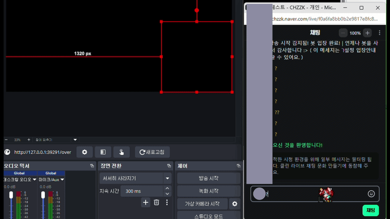
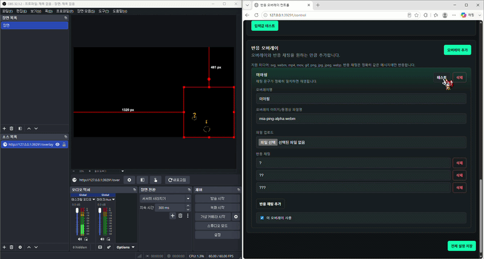
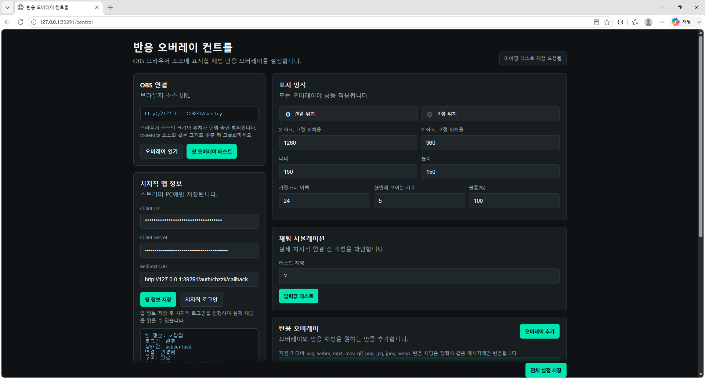
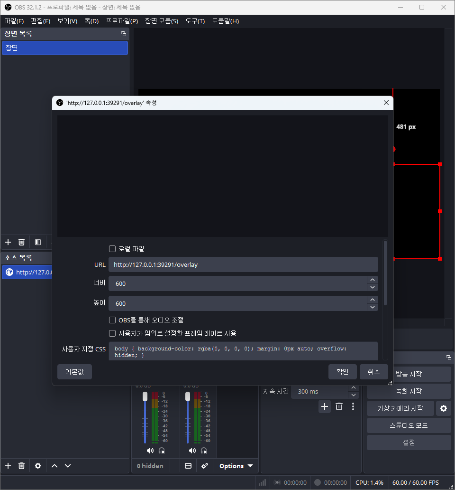

# OBS 반응 오버레이

치지직 채팅에 특정 문구가 올라오면 OBS 화면 위에 이미지·영상을 잠깐 띄워주는 프로그램입니다.

**⬇️ [최신 Windows 릴리즈 다운로드](https://github.com/picaqwe104/Stream_Overray/releases/latest)** — 압축을 풀고 `OBS_Reaction_Overlay.exe` 를 더블클릭하세요. 설치는 필요 없습니다.

> 예) 시청자가 채팅에 `?` 를 치면, 미리 설정해 둔 오버레이가 화면에 잠깐 나타납니다.

방송하는 **내 PC 안에서만** 돌아갑니다(`127.0.0.1`). 외부 서버로 아무것도 보내지 않습니다.

| 채팅에 `?` 입력 → OBS | 컨트롤 페이지 테스트 버튼 → OBS |
|:---:|:---:|
|  |  |

[English README](README.en.md)

## 필요한 것

- OBS (방송 프로그램)
- 이 프로그램 (Windows 실행 파일 또는 Python)
- 치지직 채팅을 읽기 위한 **치지직 앱 키** (무료, 아래 2번 가이드 참고)

## 1. 프로그램 실행

**A. 실행 파일로 (가장 쉬움, 추천)**

1. 받은 폴더의 압축을 풉니다.
2. `OBS_Reaction_Overlay.exe` 를 더블클릭합니다.
3. 잠시 뒤 컨트롤 페이지가 자동으로 열립니다. (안 열리면 → http://127.0.0.1:39291/control )
4. 같이 뜨는 검은 창은 서버 창입니다. **방송 중에는 닫지 마세요.**

**B. 소스로 직접 (개발자용)**

```bash
python -m venv .venv
. .venv/bin/activate          # Windows: .venv\Scripts\activate
python -m pip install -r requirements.txt
python server.py
```

그다음 브라우저에서 http://127.0.0.1:39291/control 을 엽니다.

## 2. 치지직 앱 키 발급·등록 (채팅 연동에 필요)

실제 채팅을 읽으려면 본인 명의의 치지직 앱 키가 필요합니다. **무료이고 한 번만** 하면 됩니다.

1. 치지직 개발자 센터에 접속해 로그인합니다. → https://developers.chzzk.naver.com
2. **애플리케이션 등록**을 누릅니다. 이름은 자유지만 `chzzk`, `치지직`, `naver`, `네이버` 같은 공식 서비스명은 피하세요.
3. **로그인 리디렉션 URL**에 아래 주소를 **정확히** 입력합니다.
   ```
   http://127.0.0.1:39291/auth/chzzk/callback
   ```
4. 권한(스코프)에서 **채팅 메시지 조회**를 선택합니다.
5. 등록을 마치면 **Client ID** 와 **Client Secret** 이 발급됩니다.
   Client Secret은 비밀번호처럼 다루고 남에게 공유하지 마세요.
6. 컨트롤 페이지( http://127.0.0.1:39291/control )의 **치지직 앱 정보**에 Client ID·Client Secret을 붙여넣고 **앱 정보 저장**을 누릅니다. (저장하면 화면에는 가려져 보입니다.)
7. **치지직 로그인**을 눌러 권한 동의를 마칩니다.
8. **채팅 연결 시작**을 누릅니다. 상태가 `연결: 연결됨`, `구독: 완료` 면 준비 끝입니다.

> 발급받은 키는 `credentials.json`·`chzzk_tokens.json` 으로 **내 PC에만** 저장됩니다.
> 폴더를 다른 사람에게 줄 때는 이 파일들을 빼고 보내세요.

## 3. OBS에 오버레이 연결

1. OBS에서 소스 추가 → **브라우저**를 선택합니다.
2. URL에 아래 주소를 입력합니다.
   ```
   http://127.0.0.1:39291/overlay
   ```
3. 브라우저 소스 크기를 오버레이가 나타날 영역에 맞춥니다.
4. 컨트롤 페이지의 **입력값 테스트**로 OBS에 오버레이가 보이는지 확인합니다. (등록된 오버레이가 없다면 먼저 아래 **4번**에서 추가하세요.)

## 4. 오버레이 추가하기 (처음엔 비어 있음)

처음 실행하면 등록된 오버레이가 **하나도 없습니다.** 직접 추가해야 채팅·테스트에 반응합니다.

1. 컨트롤 페이지에서 **반응 오버레이 → 오버레이 추가** 를 누릅니다.
2. **오버레이명** 을 입력합니다(관리용 이름).
3. **파일 업로드** 로 이미지/영상을 올립니다. (또는 `assets` 폴더에 파일을 직접 넣고 파일명을 입력)
   - 지원 형식: `svg, webm, mp4, mov, gif, png, jpg, jpeg, webp`
   - 동봉된 `sample-ping.svg` 로 먼저 테스트해볼 수 있습니다.
   - **미디어 추가** 로 여러 개를 등록하면 발동할 때마다 그중 하나가 **랜덤**으로 재생됩니다.
4. **반응 채팅** 에 트리거 문구를 한 줄에 하나씩 넣습니다(예: `?`, `??`). 채팅 내용과 **정확히 일치**할 때만 반응합니다.
5. **이 오버레이 사용** 을 체크합니다.
6. **전체 설정 저장** 을 누릅니다.
7. **입력값 테스트** 로 OBS에 뜨는지 확인합니다.

위쪽 **표시 방식** 에서 위치(랜덤/고정)·크기·여백·볼륨·동시 표시 개수를 조절할 수 있습니다.
오버레이 카드의 **개별 표시 설정** 을 펼치면 그 오버레이만 크기·위치를 따로 지정할 수 있습니다(체크 안 하면 전역값).
왼쪽 **최근 반응** 패널에서 어떤 채팅에 무엇이 떴는지 실시간으로 확인할 수 있습니다.

## 스크린샷

**컨트롤 페이지** — 트리거·오버레이·위치·크기·볼륨 등을 설정합니다.



**OBS 브라우저 소스 설정** — URL에 `http://127.0.0.1:39291/overlay` 를 입력합니다.



## 잘 안 될 때

- OBS에 안 보임 → 브라우저 소스 URL이 `http://127.0.0.1:39291/overlay` 인지 확인하고 **입력값 테스트**를 눌러 보세요.
- 업데이트했는데 화면이 그대로 → OBS 브라우저 소스를 **새로고침**하세요(소스 우클릭 → 새로고침). 예전 페이지가 캐시돼 바뀐 동작이 안 보일 수 있습니다.
- 채팅이 안 들어옴 → 상태가 `연결됨`/`완료` 인지 확인 → **재연결**, 그래도 안 되면 **치지직 로그인**을 다시 합니다.
- 더 자세한 단계별 설명은 `README.txt` 를 참고하세요.

## 개발·빌드

- Windows 실행 파일 만들기: `Build_Windows_Exe.bat` 실행 후 `Make_Distribution_Zip.bat`
- 구성: `server.py`(로컬 서버·치지직 연동·SSE 전송), `public/control.html`(설정 UI), `public/overlay.html`(OBS 페이지), `assets/`(미디어)
- 상태 확인 API: http://127.0.0.1:39291/api/health
- `build/`, `dist/`, `*.zip` 과 로컬 키 파일(`credentials.json`, `chzzk_tokens.json`, `chzzk_auth_state.json`, `config.json`)은 커밋하지 않습니다.

## 버전 관리

이 프로젝트는 [유의적 버전(SemVer)](https://semver.org/lang/ko/)을 따릅니다(`vMAJOR.MINOR.PATCH`).
변경 내역은 [CHANGELOG.md](CHANGELOG.md) 에 기록하며, 릴리즈는
[GitHub Releases](https://github.com/picaqwe104/Stream_Overray/releases) 에 Windows 패키지를 첨부해 배포합니다.
커밋 메시지는 [Conventional Commits](https://www.conventionalcommits.org/) 형식을 따릅니다.

## 크레딧 / 저작권

이 저장소와 배포 패키지에는 **게임 에셋이 포함되어 있지 않습니다.** 기본 상태는 오버레이가 비어 있고, 사용자가 직접 미디어를 추가합니다.

데모 GIF에 보이는 물음표 핑은 **리그 오브 레전드의 "미아핑"** 애니메이션(저작권: Riot Games, Inc.)으로 **설명용으로만** 표시됩니다. ([받은 곳](https://cromakeyuploader.tistory.com/entry/%EB%A1%A4-%EB%AC%BC%EC%9D%8C%ED%91%9C-%ED%95%91-LOL-question-mark-green-screen) — 원출처 아님)

LoL 등 Riot 게임 에셋을 **직접 추가해서** 쓰는 경우, Riot의 ["Legal Jibber Jabber"](https://www.riotgames.com/en/legal) 정책상 **비영리 팬 사용만 허용**되며 다음 고지가 필요합니다:

> OBS Reaction Overlay was created under Riot Games' "Legal Jibber Jabber" policy using assets owned by Riot Games. Riot Games does not endorse or sponsor this project.

상업적 사용(판매·후원·크라우드펀딩 등) 시에는 본인이 권리를 가진 미디어를 사용하세요. 자세한 내용은 [`THIRD_PARTY_LICENSES.txt`](THIRD_PARTY_LICENSES.txt). (법률 자문 아님)

## 라이선스

MIT 라이선스는 **이 프로젝트의 코드**에 적용됩니다. 번들된 미디어 저작권은 위 크레딧을 따릅니다. 자세한 내용은 `LICENSE` 를 확인하세요.
